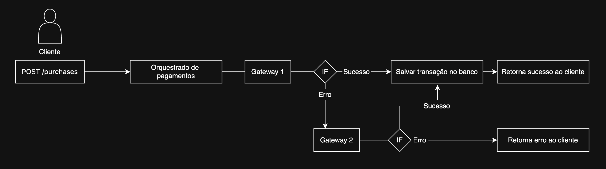

# Multi-Gateway Payment API

Saudações, equipe **BeTalent**. Externo meu agradecimento pela oportunidade de participar
deste processo seletivo.

Implementei o Nível 3 da especificação. A API gerencia um fluxo completo de pagamentos:
o cliente realiza uma compra informando múltiplos produtos com suas quantidades, o sistema
calcula o valor total via back-end somando os produtos selecionados e tenta processar a
cobrança pelo gateway de maior prioridade, fazendo fallback automático para o próximo em
caso de falha. Se o cliente ainda não existir no banco, é criado automaticamente no momento
da compra.

Toda a lógica de comunicação com os gateways é isolada via padrão Adapter, tornando
simples a adição de novos provedores no futuro. O acesso às rotas privadas é controlado
por roles (ADMIN, MANAGER, FINANCE, USER), transações podem ser reembolsadas pelo gateway
de origem e o histórico completo de compras fica vinculado ao cliente. A infraestrutura
roda inteiramente via Docker Compose com MySQL, aplicação e mock dos gateways.

Já havia trabalhado com APIs de gateway de pagamento usando Fastify, mas não em um
cenário multi-gateway com fallback automático, o que tornou esse teste especialmente
interessante. A novidade foi o AdonisJS, framework que não fazia parte do meu stack e
que definitivamente entrou nele após esse projeto. O que mais me impressionou foi a
abordagem batteries-included: CLI, ORM (Lucid), validação (VineJS), serializers e testes
integrados nativamente, sem necessidade de configurar ou acoplar peças separadas — um
framework com muito mais recursos a explorar, e que certamente vou continuar estudando.

---

## Sumário

- [Stack Tecnológica](#stack-tecnológica)
- [Arquitetura](#arquitetura)
- [Instalação e Execução](#instalação-e-execução)
- [Variáveis de Ambiente](#variáveis-de-ambiente)
- [Banco de Dados](#banco-de-dados)
- [Autenticação](#autenticação)
- [Rotas da API](#rotas-da-api)
- [Roles e Permissões](#roles-e-permissões)
- [Gateways de Pagamento](#gateways-de-pagamento)
- [Testes](#testes)

---

## Stack Tecnológica

| Tecnologia | Versão | Uso |
|---|---|---|
| Node.js | 24 | Runtime |
| TypeScript | 5.9 | Linguagem |
| AdonisJS | 7 | Framework |
| Lucid ORM | 22 | Queries, migrations e models |
| VineJS | 4 | Validação de dados |
| Japa | 5 | Testes funcionais |
| MySQL | 8.0 | Banco de dados |
| Docker | node:24-alpine | Containerização |

---

## Arquitetura

#### Fluxo de Pagamento com Fallback



#### Padrão Adapter para Gateways

Cada gateway implementa a mesma interface `GatewayInterface`, isolando as diferenças de protocolo:

```
GatewayInterface
  ├── GatewayOneService  → Auth: POST /login → JWT Bearer token (60s)
  └── GatewayTwoService  → Auth: Headers fixos (Auth-Token + Auth-Secret)
```

#### Como adicionar um novo gateway

1. Criar a pasta do gateway em `app/services/gateway_adapters/`
2. Criar a interface `gateway_example.interface.ts` dentro da pasta
3. Criar o adapter `gateway_example.service.ts` implementando `GatewayInterface`
4. Registrar no `gatewayMap` do `gateway.service.ts`
5. Adicionar as credenciais no `.env`
6. Inserir o registro no banco via seed ou migration

---

## Instalação e Execução

#### Requisitos

- [Docker](https://www.docker.com/) e Docker Compose

> Node.js não é necessário localmente — tudo roda dentro do container Docker.

#### 1. Clonar o repositório

```bash
git clone https://github.com/nikol4ss/multi-gateway-payment-api.git
cd multi-gateway-payment-api
```

#### 2. Configurar variáveis de ambiente

```bash
cp .env.example .env
```

Edite o `.env` com os valores desejados. O `.env.example` contém todos os campos necessários com referência de nomenclatura.

#### 3. Subir os containers

```bash
docker compose up --build
```

Isso sobe três serviços:

| Container | Porta | Descrição |
|---|---|---|
| `betalent_app` | 3333 | API AdonisJS |
| `betalent_mysql` | 3306 | Banco de dados MySQL 8 |
| `betalent_gateways` | 3001 / 3002 | Mock dos gateways de pagamento |

> Aguarde o log `[ info ] started HTTP server on localhost:3333` antes de continuar.

#### 4. Rodar as migrations

```bash
docker compose exec app node ace migration:run
```

#### 5. Popular o banco com dados iniciais

```bash
docker compose exec app node ace db:seed
```

Os seeds criam:

**Usuários:**

| Email | Senha | Role |
|---|---|---|
| admin@betalent.com | admin123 | ADMIN |
| manager@betalent.com | manager123 | MANAGER |
| finance@betalent.com | finance123 | FINANCE |

**Produtos:**

| Nome | Valor |
|---|---|
| Plano Basic | R$ 49,90 |
| Plano Pro | R$ 99,90 |
| Plano Enterprise | R$ 299,90 |
| Suporte Premium | R$ 19,90 |

**Gateways:**

| Nome | Prioridade | Status |
|---|---|---|
| Gateway 1 | 1 | Ativo |
| Gateway 2 | 2 | Ativo |

---

## Variáveis de Ambiente

```env
# Node
TZ=UTC
PORT=3333
HOST=localhost
NODE_ENV=development

# App
LOG_LEVEL=info
APP_KEY=YOUR_APP_KEY_HERE
APP_URL=http://${HOST}:${PORT}

# Session
SESSION_DRIVER=cookie

# MySQL
DB_ROOT_PASSWORD=YOUR_DB_ROOT_PASSWORD
DB_DATABASE=YOUR_DATABASE
DB_USER=YOUR_USER
DB_PASSWORD=YOUR_DB_PASSWORD
DB_HOST=mysql

# Gateways mock
GATEWAY_REMOVE_AUTH=false

GATEWAY1_URL=http://gateways
GATEWAY1_EMAIL=YOUR_EMAIL
GATEWAY1_TOKEN=YOUR_TOKEN

GATEWAY2_URL=http://gateways
GATEWAY2_AUTH_TOKEN=YOUR_AUTH_TOKEN
GATEWAY2_AUTH_SECRET=YOUR_AUTH_SECRET
```

> Dentro do Docker os containers se comunicam pelo nome do serviço definido no `docker-compose.yml`. Por isso `DB_HOST=mysql` e `GATEWAY1_URL=http://gateways`.

---

## Banco de Dados

| Tabela | Descrição |
|---|---|
| `users` | Usuários da plataforma |
| `auth_access_tokens` | Tokens de acesso Bearer |
| `clients` | Clientes criados automaticamente via compras |
| `products` | Produtos disponíveis para venda |
| `gateways` | Gateways de pagamento cadastrados |
| `transactions` | Transações realizadas |
| `transaction_products` | Pivot — produtos por transação com quantidade |

---

## Autenticação

A API utiliza Bearer Token via `@adonisjs/auth` com Access Tokens armazenados no banco de dados.

#### Fluxo

```
POST /api/auth/signup  →  cria conta (role USER)  →  retorna user + token
POST /api/auth/login   →  autentica               →  retorna user + token
```

#### Como usar

Inclua o token no header `Authorization` de todas as rotas privadas:

```
Authorization: Bearer {token}
```

---

## Rotas da API

A API está documentada no Postman. A collection para importação está disponível em
`postman/collection.json`.

Você também pode acessar a documentação online:
[Ver documentação](https://www.postman.com/nikol4ss/api-public/collection/43306273-9c441f93-f912-4330-b209-194eb24bb151?action=share&source=copy-link&creator=43306273)

**Base URL:** `http://localhost:3333/api`

#### Auth

| Método | Rota | Auth | Descrição |
|---|---|---|---|
| POST | `/auth/signup` | Público | Criar conta com role USER |
| POST | `/auth/login` | Público | Autenticar e obter token |
| GET | `/auth/profile` | Bearer | Dados do usuário autenticado |
| DELETE | `/auth/logout` | Bearer | Revogar token |

#### Users

| Método | Rota | Roles | Descrição |
|---|---|---|---|
| GET | `/users` | ADMIN, MANAGER | Listar usuários |
| GET | `/users/:id` | ADMIN, MANAGER | Detalhe de usuário |
| POST | `/users` | ADMIN, MANAGER | Criar usuário com role |
| PUT | `/users/:id` | ADMIN, MANAGER | Atualizar usuário |
| DELETE | `/users/:id` | ADMIN, MANAGER | Remover usuário |

#### Products

| Método | Rota | Roles | Descrição |
|---|---|---|---|
| GET | `/products` | ADMIN, MANAGER, FINANCE | Listar produtos |
| GET | `/products/:id` | ADMIN, MANAGER, FINANCE | Detalhe de produto |
| POST | `/products` | ADMIN, MANAGER, FINANCE | Criar produto |
| PUT | `/products/:id` | ADMIN, MANAGER, FINANCE | Atualizar produto |
| DELETE | `/products/:id` | ADMIN, MANAGER, FINANCE | Remover produto |

> O campo `amount` é em centavos. Ex: `9990` = R$ 99,90.

#### Transactions

| Método | Rota | Auth | Descrição |
|---|---|---|---|
| POST | `/purchases` | Público | Realizar compra |
| GET | `/transactions` | ADMIN, MANAGER, FINANCE | Listar transações |
| GET | `/transactions/:id` | ADMIN, MANAGER, FINANCE | Detalhe de transação |
| POST | `/transactions/:id/refund` | ADMIN, FINANCE | Reembolsar transação |

#### Clients

| Método | Rota | Roles | Descrição |
|---|---|---|---|
| GET | `/clients` | ADMIN, MANAGER, FINANCE | Listar clientes |
| GET | `/clients/:id` | ADMIN, MANAGER, FINANCE | Detalhe com transações |

> Clientes são criados automaticamente ao realizar uma compra. Não há rota de criação manual.

#### Gateways

| Método | Rota | Roles | Descrição |
|---|---|---|---|
| PATCH | `/gateways/:id/toggle` | ADMIN | Ativar ou desativar |
| PATCH | `/gateways/:id/priority` | ADMIN | Alterar prioridade de execução |

---

## Gateways de Pagamento

#### Comportamento por CVV (para testes)

| CVV | Gateway 1 | Gateway 2 | Resultado |
|---|---|---|---|
| `010` | Sucesso | Sucesso | Gateway 1 processa |
| `300` | Sucesso | Falha | Gateway 1 processa |
| `100` | Falha | Sucesso | Fallback para Gateway 2 |
| `200` | Falha | Falha | `400 All gateways failed` |

#### Cartão de teste

```
cardNumber: 5569000000006063
```

#### Mocks dos gateways

Os gateways mock são fornecidos pela imagem `matheusprotzen/gateways-mock` e configurados automaticamente via `docker-compose.yml`. Para desativar a autenticação nos mocks defina `GATEWAY_REMOVE_AUTH=true` no `.env`.

---

## Testes

Testes funcionais de integração usando Japa, cobrindo todas as rotas e cenários de erro.

#### Executar todos os testes

```bash
docker compose exec app node ace test
```

#### Executar um arquivo específico

```bash
docker compose exec app node ace test --files="tests/functional/auth.spec.ts"
```

#### Cobertura

| Arquivo | Cenários testados |
|---|---|
| `auth.spec.ts` | signup, login, profile, logout — sucesso e erros |
| `user.spec.ts` | CRUD completo, validações, bloqueio por role |
| `product.spec.ts` | CRUD completo, validações, bloqueio por role |
| `transaction.spec.ts` | compra, reembolso, duplo reembolso, bloqueio por role |
| `gateway.spec.ts` | toggle, priority, validação, bloqueio por role |
| `client.spec.ts` | listagem, detalhe, 404, bloqueio por role |
